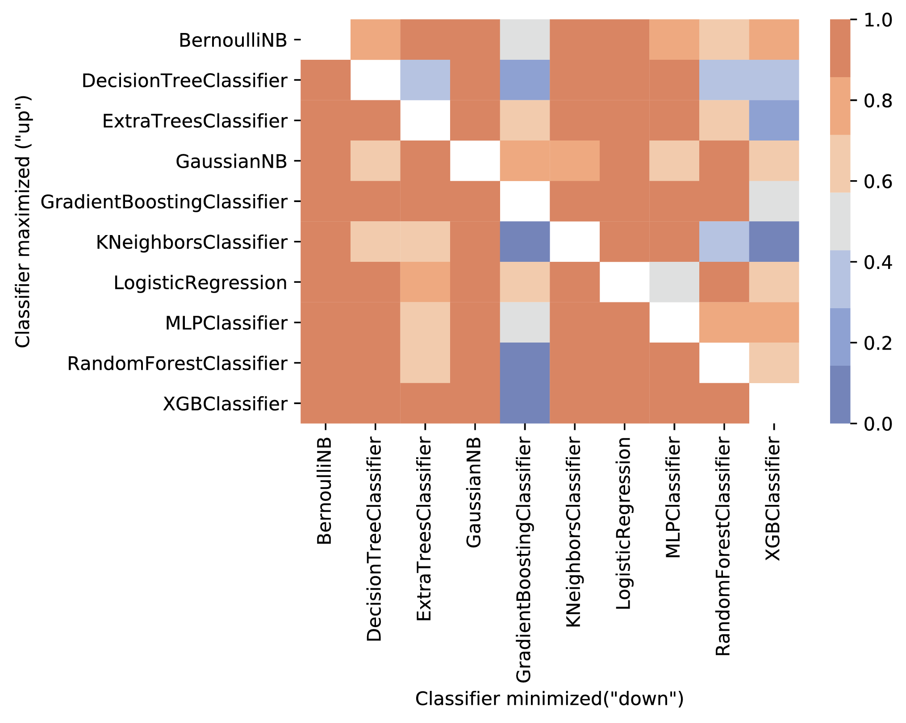

# Multilocus Risk Scores

This repository contains detailed simulation and analysis code needed to reproduce the results in this study:

**Expanding polygenic risk scores to include automatic genotype encodings and gene-gene interactions**.
Trang T. Le, Hoyt Gong, Patryk Orzechowski, Elisabetta Manduchi, Jason H. Moore.
In preparation.

## Structure of the repository 

Simulated datasets can be found in the [`simulated-data`](simulated-data) folder.

The [`mb-mdr`](mb-mdr) contains the initial ETL of the simulated datasets for further analysis, numerically named based on the wrangling process.

Resulting cleaned datasets are placed into the [`results`](results) folder?

Figures in the resulting manuscript can be found in the [`figs`](figs) folder.

We compare the results from mb-mdr to standard prs in [`analysis`](analysis) via a precision-recall & auROC analysis and visualize the results.

## Simulated data

The primary objective of this data simulation process was to provide a comprehensive set of reproducible and diverse datasets for the current study.
Containing 1000 individuals and 10 SNPs, each dataset was generated in the following manner.
For an individual, each genotype was randomly assigned with 1/2 probability of being heterozygous (*Aa*, coded as `1`), 1/4 probability of being homozygous major (*AA*, coded as `0`) and 1/4 probability of being homozygous minor (*aa*, coded as `2`).
The binary endpoint for the data was determined using a recently proposed evolutionary-based method for dataset generation called Heuristic Identification of Biological Architectures for simulating Complex Hierarchical Interactions (HIBACHI) [@doi:10.1142/9789813235533_0024].
This method uses Genetic Programming (GP) to build different mathematical and logical models resulting in a binary endpoint, such that the objective function called fitness is maximized. 
The unique feature of HIBACHI is explainability, as each generated model represents a formula for generating the endpoint. 
In this study, to arrive at a diverse collection of datasets, we aim to maximize the difference in predictive performance of all pairs of ten pre-selected classifiers from the extensive library of scikit-learn [@url:https://hal.archives-ouvertes.fr/hal-00650905/] (Table 1).
Therefore, we define the fitness function of HIBACHI as the difference in accuracy between two classifiers. In other words, the first classifier was supposed to perform as well as possible on the data while the second as bad as possible.

Table 1. Selected machine learning methods and their parameters.

| Algorithm      |                             Parameters                                         |
|:--------------:|:------------------------------------------------------------------------------:|
| GaussianNB     |'priors': {None,2}, 'var_smoothing': {1e-9, 1e-7, 1e-5, 1e-3, 1e-1, 1e+1}       |
| BernoulliNB    |'alpha': {1e-3, 1e-2, 1e-1, 1., 10., 100.},'fit_prior': {True, False}           |
| DecisionTree   |'criterion': {"gini", "entropy"}, 'max_depth': [1, 11], 'min_samples_split': [2, 21], 'min_samples_leaf': [1, 21]|
|ExtraTrees      |'n_estimators': {50,100}, 'criterion': {"gini", "entropy"},'max_features': [0.1, 1], 'min_samples_split': range(2, 21,2),'min_samples_leaf': range(1, 21,2), 'bootstrap': {True, False}|
|RandomForest    |'n_estimators': {50,100}, 'criterion': {"gini", "entropy"},'max_features': [0.1, 1], 'min_samples_split': range(2, 21,4), 'min_samples_leaf':  range(1, 21,5), 'bootstrap': {True, False}                 |
|GradientBoosting|  'n_estimators': {50,100},'learning_rate': {1e-3, 1e-2, 1e-1, 0.5, 1}, 'max_depth': {2,4,8}, 'min_samples_split': [2, 21], 'min_samples_leaf': [1, 21], 'subsample': [0.1, 1], 'max_features': [0.1, 1]|
|KNeighbors      |'n_neighbors': [1, 100], 'weights': {"uniform", "distance"} , 'p': {1, 2}   |
|LogisticRegression| 'C': {1e-3, 1e-2, 1e-1, 1., 10.}, 'solver' : {'newton-cg', 'lbfgs', 'liblinear', 'sag'}|
|XGBoost     | 'n_estimators'=100, 'max_depth': [2, 10], 'learning_rate': {1e-3, 1e-2, 1e-1, 0.5, 1.}, 'subsample': [0.05, 1], 'min_child_weight': [1, 20],
|MLPClassifier |: 'hidden_layer_sizes': {(10),(11),(12),(13),(14),(15),(10,5)},  'activation': {'logistic','tanh','relu'}, 'solver': ['lbfgs'], 'learning_rate': {'constant','invscaling'}, 'max_iter'=1000, 'alpha':np.logspace(-4,1,4)|

HIBACHI was run for 50 iterations with population of 500 individuals representing pairs of classifiers.
At each iteration, five randomly chosen settings for each of the classifiers (Table 1) were chosen among all potential options and served as hyperparameters for that method.
Each of the settings was analyzed using 5-fold cross-validation and the best set of hyperparameters for each classifier was considered for comparison. 
The best settings out of 5 for each classifiers were compared and the settings that maximized the difference in the fitness were promoted.
Each experiment in which one machine learning method was expected to outperform the other was repeated five times.
The results of each pair of classifiers were later averaged.

In order to generate each of 450 datasets, corresponding to pairwise comparisons between 10 ML methods, HIBACHI had to run for 50 iterations with 500 individuals.
At each of 50 iterations, 2 ML methods were evaluated across 500 different potential solutions to the problem using 5 different sets of hyperparameters.
This means that over 112M of evaluations of a ML method were made in order to make the further comparison objective.
As the number of potential hyperparameters differed depending on the method (so as the number of values), the methods that had the largest space had better chances to outperform the others.
The statistics showing how often a given ML method outperformed the other is presented in Figure {@fig:classcomp}.

{#fig:classcomp width="70%"}

In the majority of the scenarios, the ML method that was handicaped won against its competetitors in the vast majority of the scenarios.
It may be noticed, however, that two ML methods performed visibly better than the others, namely GradientBoosting following by XGBoost.
The methods, even run as "down" scenarios, still managed to obtain the higher accuracy in comparison to the handicapped "up" method.
There are two potential explanations for it.
First, those two ML methods are known for their stellar performance on different sets of problems and are considered one of the leading supervised ML methods.
Secondly, the size of the grid of their hyperparameters was the broadest.
This may suggest that random selection of the values of the parameters within the large grid allows the method to find more accurate solutions.